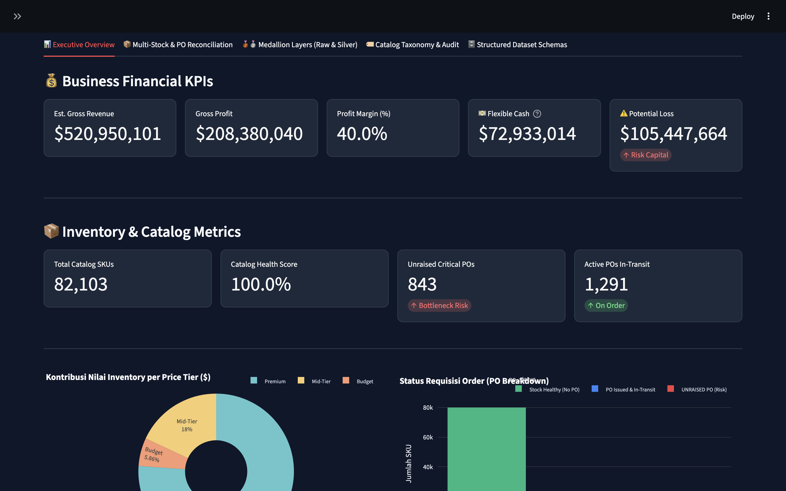
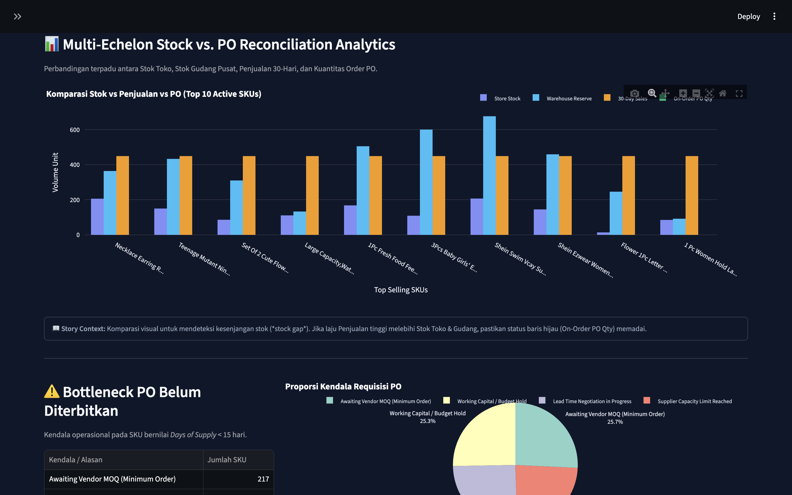
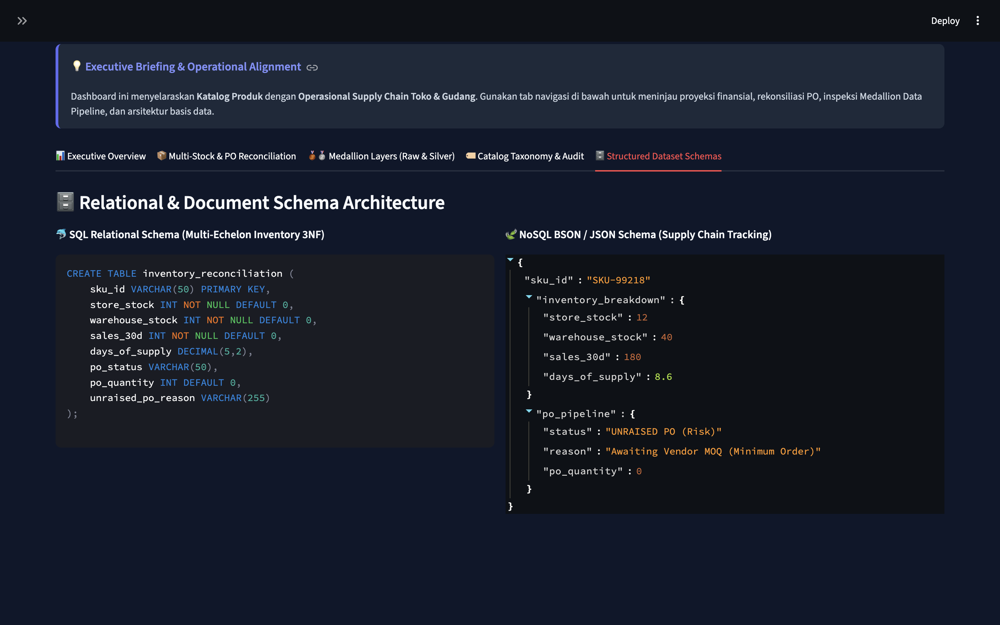

# 🛍️ Retail & E-Commerce PMO Analytics Control Tower

[](https://pmo-retail-analytics.streamlit.app/)
[](https://www.python.org/)
[-0052CC?style=for-the-badge)](#-data-architecture--pipeline)

An end-to-end executive analytics platform and catalog governance control tower designed for multi-category e-commerce operations. Built on Kaggle Shein US multi-category marketplace data, this project models end-to-end retail execution—from raw catalog ingestion to multi-echelon inventory reconciliation and financial PMO dashboards.

🔗 **Live Interactive Dashboard:** [https://pmo-retail-analytics.streamlit.app/](https://pmo-retail-analytics.streamlit.app/)

---

## 📌 Business Case & Executive Summary

E-commerce businesses operating across broad catalog taxonomies face critical operational bottlenecks:
* **Inventory Misallocation:** Stock imbalance between store fronts and central fulfillment centers leads to stockouts or bloated carrying costs.
* **Catalog Quality Leakage:** Missing attributes, inconsistent taxonomy, and poor data quality directly impact search visibility and conversion.
* **Financial Oversight:** Lack of integrated visibility connecting unit-level stock, purchase orders, and profit margins.

**Solution:** This PMO Analytics Control Tower provides single-pane-of-glass executive visibility to monitor store performance, audit catalog taxonomy health, optimize inventory replenishment, and track financial margins in real time.

---

## 📸 Executive Visual Walkthrough

### 1. Executive Financial KPIs & Revenue Summary
High-level overview tracking gross revenue, profit margins, working capital flexibility, and potential stock loss.


### 2. Multi-Echelon Stock Reconciliation & Warehouse Control
Reconciles store-level stock vs. warehouse reserve against sales velocity to detect stockout risks and purchase order bottlenecks.


### 3. Catalog Taxonomy & Data Quality Audit
Monitors catalog completeness, taxonomy standards, and product feature attribution across multiple e-commerce categories.


### 4. Enterprise Data Pipeline & Ingestion Architecture
Scalable data ingestion and storage architecture transforming raw marketplace data into structured analytical models.



---

## 🏗️ Data Architecture & Pipeline

This repository implements a **Medallion Data Architecture** pattern:

```text
  [ Raw Kaggle Datasets ] (20+ Shein Categories)
             │
             ▼
    ┌─────────────────┐
    │  BRONZE LAYER   │  Raw JSON/CSV ingestion into data/raw/
    └────────┬────────┘
             │
             ▼
    ┌─────────────────┐  Cleaning, type enforcement, currency normalization,
    │  SILVER LAYER   │  and taxonomy standardizations (shein_master_cleaned.csv)
    └────────┬────────┘
             │
             ▼
    ┌─────────────────┐  Aggregated metrics, feature engineering, RFM/clustering,
    │   GOLD LAYER    │  and inventory allocation models (shein_gold_master.csv)
    └────────┬────────┘
             │
             ▼
 📊 [ Streamlit Executive Control Tower App ]


## 🛠️ Tech Stack & Skills Demonstrated

* **Dashboard & Visualization:** Streamlit, Plotly Express, Pandas
* **Data Engineering & Modeling:** Python, ETL/ELT Pipelines, Data Cleansing, Feature Engineering
* **Data Management & Governance:** Medallion Architecture, Taxonomy Quality Auditing, Catalog Standardization
* **Domain Expertise:** Retail Operations, Supply Chain Control Tower, Multi-Echelon Inventory Management, E-Commerce Analytics

```
