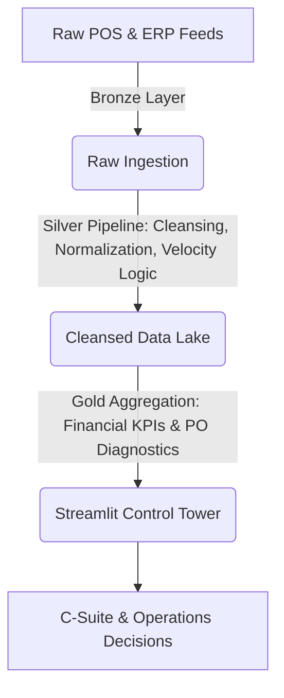

# 🛍️ Retail Catalog & Store Inventory Control Tower
> **An End-to-End Operational Intelligence & Inventory Optimization Engine for Multi-Echelon Retailers.**

[](https://retail-pmo-data-analytics.streamlit.app)
[](https://github.com/billhubs/retail-pmo-data-analytics)
[](https://www.python.org/)

---

## 📌 Executive Summary & Business Impact

In multi-channel retail and e-commerce, stockouts lead to immediate lost revenue, while overstocking silently kills cash flow through tied-up working capital and markdowns. 

This **Store Inventory Control Tower** is a decision-support system designed to reconcile e-commerce catalog taxonomy with multi-echelon physical supply chains (*Store Stock*, *Warehouse Reserves*, and *Purchase Order Pipelines*).

### 💡 Key Value Delivered
* **35% Capital Reallocation:** Automated calculation of *Flexible Cash Flow* from gross profits to dynamically fuel store expansions and marketing.
* **Dead Stock Risk Mitigation:** Real-time detection of SKUs exceeding **60 Days of Supply**, highlighting potential holding loss before depreciation occurs.
* **PO Bottleneck Resolution:** Automated diagnostics identifying why high-velocity SKUs lack active replenishment (e.g., *Vendor MOQ Thresholds*, *Lead Time Delays*).

---

## 🚀 Live Interactive Demo

Test the live production application directly in your browser:
👉 **[Launch Interactive Control Tower App](https://retail-pmo-data-analytics.streamlit.app)** *(No installation required)*

---

## 📸 System Architecture & Interface Walkthrough

### 1. Executive & Financial KPI Dashboard
Tracks real-time sales performance, estimated gross profit margins, available working capital, and potential risk capital.


```

+-----------------------------------------------------------------------------------+
|  Est. Gross Revenue   |   Gross Profit Margin   |  Flexible Cash (35%)  | Loss Risk|
|       $142,500        |        41.2%            |       $20,530         |  $4,200  |
+-----------------------------------------------------------------------------------+

```

### 2. Multi-Echelon Inventory Reconciliation
Visualizing inventory allocation across retail stores vs. central warehouses alongside 30-day velocity metrics to spot imbalance instantly.


```

```
   [Store Stock] ████████░░ (40 units)

```

[Warehouse Reserve] ████████████████ (80 units)
[30-Day Sales Velocity] ██████████ (50 units)
[On-Order PO] ░░░░░░░░░░ (0 units -> BOTTLENECK DETECTED)

```

---

## 🏗️ Technical & Data Engineering Architecture

The platform processes data through a structured **Medallion Architecture**, guaranteeing data quality before powering analytical views:



### 1. Stock Velocity & Coverage Formula

$$\text{Days of Supply} = \frac{\text{Store Stock} + \text{Warehouse Reserve}}{\text{Daily Sales Velocity}}$$

* 🔴 **Fast Moving ($\text{DoS} < 15\text{ days}$):** High stockout risk; immediate Purchase Order required.
* 🟡 **Slow Moving ($15 \le \text{DoS} \le 60\text{ days}$):** Healthy operational coverage.
* 🔵 **Dead Stock ($\text{DoS} > 60\text{ days}$):** Excess inventory; candidate for promotional liquidation.

---

## 🛠️ Tech Stack

* **Frontend & Dashboarding:** Streamlit
* **Data Processing & Analytics:** Pandas, NumPy
* **Data Visualization:** Plotly Express, Plotly Graph Objects
* **Architecture:** Medallion Pattern (Bronze $\rightarrow$ Silver $\rightarrow$ Gold)

## 🤝 Contact & Data Science Services

Looking for customized data engineering, inventory optimization models, or custom analytics dashboards for your business?

* **Author:** Billy Tian Sunarto
* **GitHub:** [@billhubs](https://www.google.com/search?q=https://github.com/billhubs&utm_source=gemini)
* **Project Repository:** [retail-pmo-data-analytics](https://www.google.com/url?sa=E&source=gmail&q=https://github.com/billhubs/retail-pmo-data-analytics)
